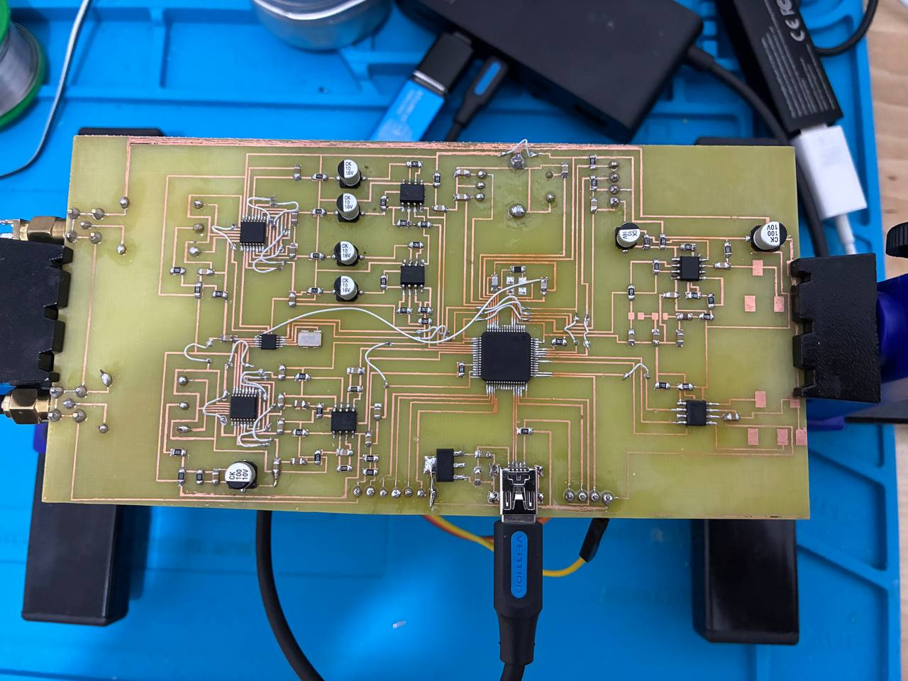
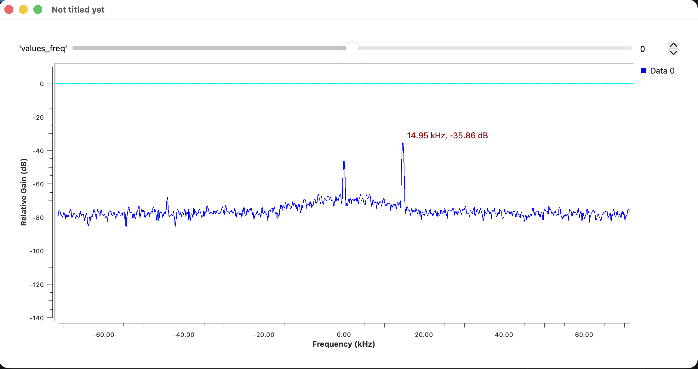
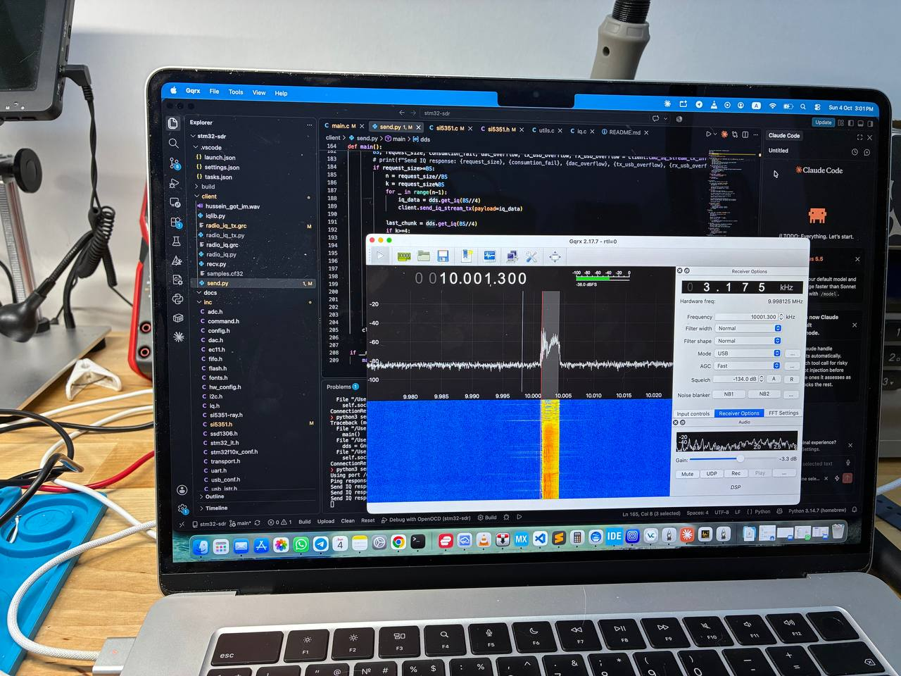

# STM32 SDR

A homebrew software-defined radio built around an STM32F103 (Cortex-M3) and an Si5351 clock generator.
The MCU samples I/Q from a quadrature mixer with its two ADCs, plays I/Q back out through its dual DAC,
and streams both directions to a PC over USB (CDC virtual COM port). On the PC, Python scripts bridge the
stream to GNU Radio over TCP.



*The single-layer prototype board: STM32F103 in the middle, Si5351 + reference oscillator on the left, RF connectors on the left edge, mini-USB at the bottom.*

## Features

- **Local oscillator**: Si5351 over I²C, tuned to 10 MHz at boot and retunable at runtime with `CMD_SET_FREQ` (in `duplex.py`: type `f 7100000` while it runs).
- **Front panel**: 0.91" SSD1306 OLED (128×32) on the same I²C bus as the Si5351, EC11 encoder on PA1/PA2 with its push switch on PA0 ([src/ui.c](src/ui.c)). Turn to tune by the current step, short push to cycle the step 10 Hz → 1 MHz (underlined digit), hold for 0.7 s to toggle RX/TX; the display also shows RX/TX and follows host commands.
  CLK2 outputs 8 MHz, which drives the MCU's HSE (bypass mode) → 72 MHz system clock via PLL.
- **RX**: ADC1 + ADC2 in regular simultaneous mode (PA6 / PA7), DMA in circular mode,
  ≈142.857 kS/s (12 MHz ADC clock / 84 cycles). Samples are packed 2×12 bit into 32-bit words.
- **TX**: dual 12-bit DAC (PA4 / PA5) triggered by TIM2 at 64 kS/s, fed by DMA2 from a 10 KB FIFO.
- **USB transport**: framed binary protocol with checksums, flow-control info for TX and
  overflow counters for both directions.
- **PC client**: Python (`pyserial`, `numpy`) + GNU Radio flowgraphs for receiving and transmitting.

## Results

### Receive

Spectrum of the received baseband in GNU Radio — a test tone at +14.95 kHz from the LO, ~40 dB above the noise floor across the ±71 kHz span:



### Transmit

I/Q streamed from the PC through the DAC and upconverted around 10 MHz, received by an RTL-SDR in Gqrx (USB mode at 10.001300 MHz):



## Repository layout

| Path | Contents |
| --- | --- |
| [src/](src/), [inc/](inc/) | Firmware: ADC/DAC + DMA, Si5351 driver, USB CDC, framing protocol, FIFOs, SSD1306/EC11 drivers |
| [libs/](libs/) | Git submodule with STM32F10x StdPeriph 3.6.1, CMSIS 4.3.0, USB-FS device driver 4.1.0 and startup code |
| [ldscripts/](ldscripts/) | Linker scripts for STM32F103RE |
| [client/](client/) | Python host library, RX/TX scripts and GNU Radio flowgraphs |
| [docs/](docs/) | Photos and screenshots |

## Building the firmware

Requirements: CMake ≥ 3.20, an `arm-none-eabi` GCC toolchain (configured in [cubeide-gcc.cmake](cubeide-gcc.cmake)),
OpenOCD and an ST-Link V2.

```sh
git clone --recursive https://github.com/7ingsong/stm32-tayloe-sdr.git
cd stm32-tayloe-sdr

make            # debug build  -> build/stm32_cmake.elf
make release    # release build
make upload     # flash via ST-Link + OpenOCD
make reset      # reset the target
make clean
```

If you cloned without `--recursive`, run `git submodule update --init` first.

## Running the PC client

```sh
cd client
pip install pyserial numpy matplotlib
```

The device is auto-detected as a USB CDC serial port (see `auto_detect_port` in [client/iqlib.py](client/iqlib.py)).

**Receive**: open [client/radio_iq.grc](client/radio_iq.grc) in GNU Radio Companion (it listens on TCP `127.0.0.1:2000`), then:

```sh
python recv.py
```

`recv.py` starts the RX stream, converts the 12-bit samples to `complex64` and forwards them to GNU Radio,
also saving a copy to `samples.cf32`.

**Transmit**: open [client/radio_iq_tx.grc](client/radio_iq_tx.grc) (it serves I/Q on TCP `127.0.0.1:2000`), then:

```sh
python send.py
```

`send.py` polls the device for free FIFO space and sends exactly that much I/Q. It also has built-in test
generators (`SinTx`, `SinTxNoLUT`, `GenMeander`) you can swap in place of the GNU Radio source.

## USB protocol

Every packet, in both directions:

| Offset | Size | Field |
| --- | --- | --- |
| 0 | 2 | Magic `A5 5A` |
| 2 | 1 | Command / response code |
| 3 | 1 | Sequence number |
| 4 | 2 | Payload length (LE, max 256) |
| 6 | 2 | Checksum (LE): 16-bit byte sum of cmd, seq, len and payload |
| 8 | n | Payload |

| Command | Code | Response |
| --- | --- | --- |
| `CMD_PING` | `0x01` | `RESP_ACK` with `"PONG"` |
| `CMD_IQ_STREAM_TX` | `0x31` | — (payload is appended to the DAC FIFO) |
| `CMD_IQ_STREAM_TX_INFO` | `0x32` | `RESP_IQ_STREAM_TX_INFO` (`0xB2`): block size, free space, underrun / overflow counters |
| `CMD_IQ_STREAM_TX_START` / `_STOP` | `0x33` / `0x34` | `RESP_ACK`. The DAC runs from boot for the on-board radio (see `CMD_PTT`); `START` hands the DAC to the host stream (and idles the on-board radio), `STOP` gives it back |
| `CMD_IQ_STREAM_RX_START` / `_STOP` | `0x35` / `0x36` | `RESP_ACK`; while running, the device sends `RESP_IQ_STREAM_RX` (`0xB1`) frames of 256 bytes. The ADC itself runs from boot (it also feeds the on-board SSB receiver on I2S, [src/ssb_rx.c](src/ssb_rx.c)), these only gate the USB stream |
| `CMD_PTT` | `0x42` | On-board half-duplex radio. Payload `uint8`: `0` = receive (SSB demodulator on I2S, [src/ssb_rx.c](src/ssb_rx.c); DAC silent), `1` = transmit (mic on PA3 → SSB modulator → DAC, [src/ssb_tx.c](src/ssb_tx.c); I2S silent); empty = just read. Receive at boot. `RESP_ACK` with the state in effect |
| `CMD_VOLUME` | `0x43` | On-board receiver volume. Payload `uint8` 0..255 (0 = mute, 8 ≈ −30 dBFS at full-scale input, each doubling +6 dB; 16 at boot), empty = just read. `RESP_ACK` with the volume |
| `CMD_MIC_GAIN` | `0x44` | On-board transmitter mic gain. Payload `uint8` 0..255 (0 = silence, 16 ≈ full-scale mic → full-scale DAC, each doubling +6 dB; 16 at boot), empty = just read. `RESP_ACK` with the gain |
| `CMD_SPECTRUM` | `0x45` | TFT spectrum smoothing. Payload `[rise_shift, fall_shift, smooth_bins]` (shifts 0..7: each frame a bin moves 1/2^n of the way to its new level, 0 = jump; smooth_bins 0/1 = average neighbouring bins 1-2-1), empty = just read. `RESP_ACK` with the values in effect |
| `CMD_SET_FREQ` | `0x40` | Payload: LO in Hz as `uint32` LE (1.4–100 MHz), or empty to just read it. `RESP_ACK` with the LO in effect as `uint32` LE; out of range → `ERR_BAD_PAYLOAD` |

Errors come back as `RESP_ERR` (`0x81`) with `[error_code, detail]` — see [inc/command.h](inc/command.h) for the codes.
